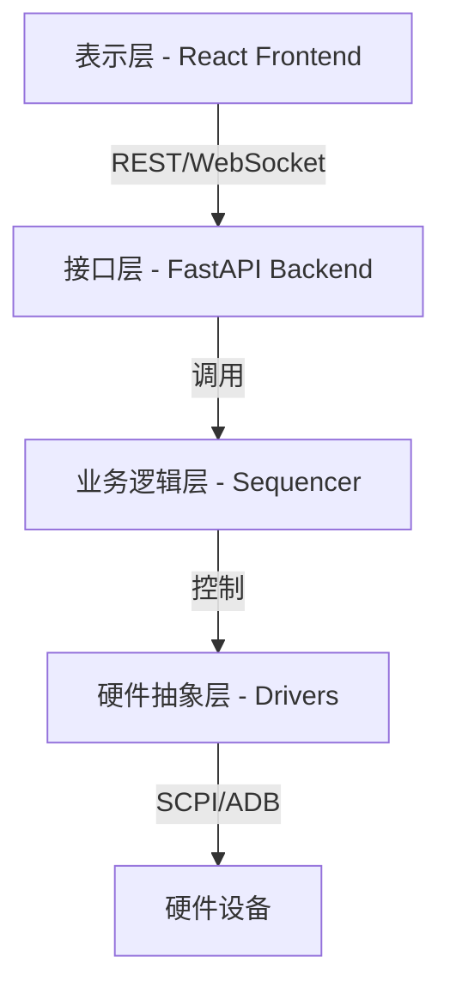
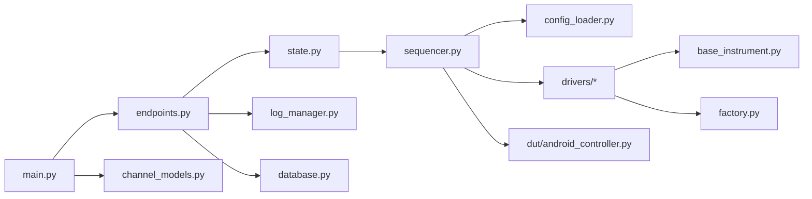
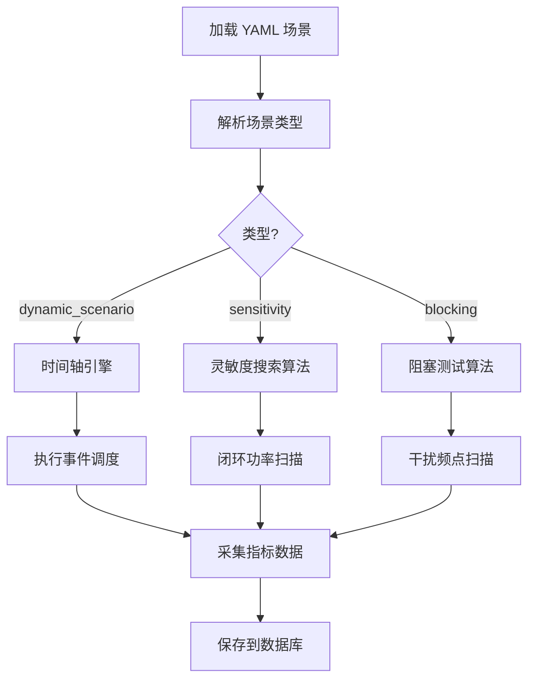
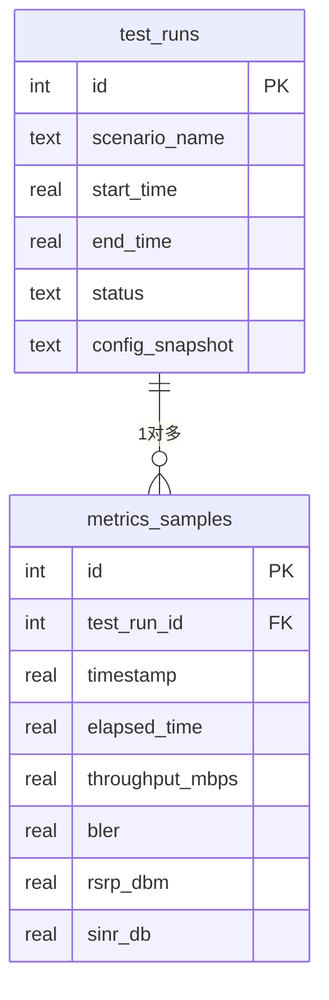

# 终端宽带标准信道验证系统 - 详细设计文档

**项目版本**: v1.0  
**文档版本**: 1.0  
**最后更新**: 2026-01-17  
**作者**: Gemini System

---

## 目录

1. [系统概述](#1-系统概述)
2. [架构设计](#2-架构设计)
3. [后端模块详解](#3-后端模块详解)
4. [前端模块详解](#4-前端模块详解)
5. [数据库设计](#5-数据库设计)
6. [API 接口规范](#6-api-接口规范)
7. [配置文件规范](#7-配置文件规范)

---

## 1. 系统概述

### 1.1 项目简介

本系统是一个**自动化射频测试框架**，用于编排和执行涉及多种射频仪表（矢量网络分析仪、矢量信号发生器、信道模拟器、综合综测仪、频谱仪）和被测件（Android 终端）的宽带信道验证测试。

**核心特性**：
- ✅ **分层架构**：清晰的职责分离，易维护和扩展
- ✅ **硬件抽象**：统一的驱动接口，支持多厂商仪表
- ✅ **模拟模式**：无硬件环境也可开发和测试
- ✅ **Web 界面**：React + FastAPI 实现可视化监控
- ✅ **实时数据**：WebSocket 推送测试进度和指标

### 1.2 技术栈

| 层次 | 技术选型 |
|-----|---------|
| **后端框架** | FastAPI (Python 3.13) |
| **前端框架** | React 18 + TypeScript + Material-UI v7 |
| **硬件通信** | PyVISA (SCPI/LXI) |
| **DUT 控制** | ADB (Android Debug Bridge) |
| **数据库** | SQLite 3 |
| **实时通信** | WebSocket |
| **CI/CD** | GitHub Actions + Ruff + ESLint |

### 1.3 部署架构

```
┌─────────────────────────────────────────────────────────────┐
│                    用户浏览器                                  │
│              (http://localhost:5173)                        │
└───────────────────┬─────────────────────────────────────────┘
                    │ HTTP/WebSocket
┌───────────────────▼─────────────────────────────────────────┐
│               React 前端 (Vite Dev Server)                   │
│  - Dashboard / ConfigEditor / TestHistory / ChannelModels   │
└───────────────────┬─────────────────────────────────────────┘
                    │ REST API / WebSocket
┌───────────────────▼─────────────────────────────────────────┐
│             FastAPI 后端 (http://127.0.0.1:8000)            │
│  - API Endpoints - LogManager - Database - Sequencer       │
└─────────────┬───────────────────┬───────────────────────────┘
              │                   │
    ┌─────────▼────────┐  ┌───────▼──────────┐
    │  硬件驱动层 (HAL)  │  │  DUT 控制器 (ADB)  │
    │  - VNA / VSG     │  │  - Android 终端    │
    │  - CE / Tester   │  └──────────────────┘
    │  - SA            │
    └─────────┬────────┘
              │ SCPI/LXI
    ┌─────────▼────────┐
    │   射频仪表硬件      │
    │  (真实设备/模拟)    │
    └──────────────────┘
```

---

## 2. 架构设计

### 2.1 分层架构

系统采用**四层架构**：



#### 层次职责

| 层次 | 职责 | 主要模块 |
|------|------|---------|
| **表示层** | 用户交互、数据可视化 | Dashboard, ConfigEditor, TestHistory |
| **接口层** | HTTP API、WebSocket 推送 | FastAPI App, Endpoints |
| **业务逻辑层** | 测试编排、场景执行 | TestSequencer, Config Loader |
| **硬件抽象层** | 仪表控制、协议封装 | VNA/VSG/CE/Tester/SA Drivers |

### 2.2 模块依赖图



---

## 3. 后端模块详解

### 3.1 核心模块 - TestSequencer

**文件位置**: `backend/core/sequencer.py`

**职责**: 测试编排和执行引擎，负责场景加载、设备初始化、事件调度和数据采集。

#### 3.1.1 类定义

```python
class TestSequencer:
    """测试编排器 - 系统核心大脑"""
```

#### 3.1.2 构造函数

```python
def __init__(
    self, 
    config: Dict[str, Any], 
    simulation_mode: bool = False,
    log_callback: Optional[Callable[[str], None]] = None,
    metrics_callback: Optional[Callable[[Dict[str, Any]], None]] = None
)
```

**参数**:
- `config` (Dict): 测试配置字典，包含 instruments, dut, test_cases
- `simulation_mode` (bool): 是否启用模拟模式（默认 False）
- `log_callback` (Optional[Callable]): 日志回调函数，用于实时推送日志
- `metrics_callback` (Optional[Callable]): 指标回调函数，用于实时推送测试数据

**返回值**: 无

**实例变量**:
```python
self.config: Dict[str, Any]               # 配置字典
self.simulation_mode: bool                # 模拟模式标志
self.logger: logging.Logger               # 日志器
self.instruments: Dict[str, Any]          # 已连接的仪表 {name: instance}
self.dut: Optional[AndroidController]     # DUT 控制器实例
self.log_callback: Optional[Callable]     # 日志回调
self.metrics_callback: Optional[Callable] # 指标回调
self._running: bool                       # 运行状态标志
self._start_time: Optional[float]         # 测试开始时间戳
self._elapsed_time: float                 # 已运行时间
self.current_scenario: Optional[Dict]     # 当前场景配置
self.metrics_history: List[Dict]          # 指标历史数据
```

#### 3.1.3 主要方法

##### 初始化仪表连接

```python
def initialize_instruments(self) -> None
```

**功能**: 根据配置初始化所有仪表连接

**流程**:
1. 遍历 `config['instruments']`
2. 使用 `DriverFactory` 创建驱动实例
3. 调用 `connect()` 方法建立连接
4. 存储到 `self.instruments` 字典

**异常**: 
- `ConnectionError`: 连接失败时抛出

**示例**:
```python
sequencer = TestSequencer(config, simulation_mode=True)
sequencer.initialize_instruments()  # 连接所有仪表
```

##### 执行测试场景

```python
async def run_scenario(self, scenario_file: str) -> None
```

**功能**: 加载并执行一个测试场景

**参数**:
- `scenario_file` (str): 场景文件名（相对于 scenarios/ 目录）

**流程**:


**异常**:
- `FileNotFoundError`: 场景文件不存在
- `ValueError`: 场景格式错误

##### 执行时间轴事件

```python
def _execute_timeline_event(self, event: Dict[str, Any]) -> None
```

**功能**: 执行单个时间轴事件

**参数**:
- `event` (Dict): 事件配置，包含 time, target, action, params

**事件格式**:
```yaml
- time: 5                        # 偏移时间（秒）
  target: "channel_emulator"     # 目标仪表名称
  action: "set_path_loss"        # 动作方法名
  params: { db: 80 }             # 方法参数
  comment: "设置路损"            # 可选注释
```

**执行逻辑**:
```python
# 1. 获取目标仪表实例
instrument = self.instruments[event['target']]

# 2. 获取方法
method = getattr(instrument, event['action'])

# 3. 调用方法
method(**event['params'])
```

**异常**:
- `KeyError`: 仪表不存在
- `AttributeError`: 方法不存在
- `TypeError`: 参数不匹配

---

### 3.2 硬件抽象层 - Drivers

#### 3.2.1 基类 - BaseInstrument

**文件位置**: `backend/drivers/base_instrument.py`

```python
class BaseInstrument(ABC):
    """所有仪表驱动的抽象基类"""
    
    @abstractmethod
    def connect(self) -> None:
        """建立连接"""
        pass
    
    @abstractmethod
    def disconnect(self) -> None:
        """断开连接"""
        pass
    
    @abstractmethod
    def get_driver_info(self) -> Dict[str, Any]:
        """获取驱动信息"""
        pass
```

#### 3.2.2 信道模拟器 - ChannelEmulator

**文件位置**: `backend/drivers/channel_emulator.py`

```python
class ChannelEmulator:
    """信道模拟器驱动代理"""
```

**构造函数**:
```python
def __init__(self, resource_id: str, vendor: str = "generic", simulation: bool = False)
```

**参数**:
- `resource_id` (str): VISA 资源地址，如 `"TCPIP0::192.168.1.102::inst0::INSTR"`
- `vendor` (str): 厂商名称 - `"spirent"`, `"keysight"`, `"generic"`
- `simulation` (bool): 是否模拟模式

**方法列表**:

| 方法名 | 参数 | 返回值 | 功能 |
|-------|------|-------|------|
| `connect()` | 无 | None | 建立 VISA 连接 |
| `disconnect()` | 无 | None | 断开连接 |
| `load_channel_model(model: str)` | model: 模型文件名 | None | 加载信道模型 |
| `set_path_loss(db: float)` | db: 路损值(dB) | None | 设置路径损耗 |
| `set_velocity(kmh: float)` | kmh: 速度(km/h) | None | 设置多普勒速度 |
| `set_distance(km: float)` | km: 距离(km) | None | 设置模拟距离 |
| `trigger_fading(profile: str)` | profile: 衰落配置名 | None | 触发衰落 |
| `trigger_handover(target_cell: int)` | target_cell: 目标小区ID | None | 触发切换 |
| `rf_on()` | 无 | None | 启动射频输出 |
| `rf_off()` | 无 | None | 关闭射频输出 |

**使用示例**:
```python
# 创建实例
ce = ChannelEmulator(
    resource_id="TCPIP0::192.168.1.102::inst0::INSTR",
    vendor="spirent",
    simulation=True
)

# 连接
ce.connect()

# 加载信道模型
ce.load_channel_model("3GPP_UMA_SCENARIO.scn")

# 设置参数
ce.set_path_loss(85.0)
ce.set_velocity(120)

# 启动
ce.rf_on()

# 清理
ce.rf_off()
ce.disconnect()
```

#### 3.2.3 矢量信号发生器 - VSG

**文件位置**: `backend/drivers/vsg.py`

```python
class VSG(BaseInstrument):
    """矢量信号发生器驱动代理"""
```

**方法列表**:

| 方法名 | 参数 | 返回值 | 功能 |
|-------|------|-------|------|
| `set_frequency(hz: float)` | hz: 频率(Hz) | None | 设置中心频率 |
| `set_power(dbm: float)` | dbm: 功率(dBm) | None | 设置输出功率 |
| `load_waveform(path: str)` | path: 波形文件路径 | None | 加载 ARB 波形 |
| `rf_on()` | 无 | None | 启动射频输出 |
| `rf_off()` | 无 | None | 关闭射频输出 |

#### 3.2.4 综合综测仪 - IntegratedTester

**文件位置**: `backend/drivers/integrated_tester.py`

**方法列表**:

| 方法名 | 参数 | 返回值 | 功能 |
|-------|------|-------|------|
| `start_cell()` | 无 | None | 启动基站仿真 |
| `stop_cell()` | 无 | None | 停止基站仿真 |
| `get_throughput()` | 无 | float | 获取吞吐量(Mbps) |
| `get_bler()` | 无 | float | 获取误块率 |
| `get_rsrp()` | 无 | float | 获取 RSRP(dBm) |
| `get_sinr()` | 无 | float | 获取 SINR(dB) |
| `configure_cell(freq_hz, bw_mhz, power_dbm)` | 频率/带宽/功率 | None | 配置小区参数 |

---

### 3.3 DUT 控制器

**文件位置**: `backend/dut/android_controller.py`

```python
class AndroidController:
    """Android 终端控制器（通过 ADB）"""
```

**构造函数**:
```python
def __init__(self, device_id: str = None, simulation: bool = False)
```

**参数**:
- `device_id` (Optional[str]): 设备序列号，None 表示自动选择
- `simulation` (bool): 模拟模式

**方法列表**:

| 方法名 | 参数 | 返回值 | 功能 |
|-------|------|-------|------|
| `connect()` | 无 | None | 建立 ADB 连接 |
| `disconnect()` | 无 | None | 断开连接 |
| `is_connected()` | 无 | bool | 检查连接状态 |
| `get_modem_status()` | 无 | ModemStatus | 获取 Modem 状态 |
| `set_airplane_mode(enabled: bool)` | enabled: 开/关 | None | 设置飞行模式 |
| `start_traffic(server_ip, duration, bandwidth)` | 流量测试参数 | None | 启动 iPerf 流量 |
| `stop_traffic()` | 无 | None | 停止流量测试 |

**ModemStatus 数据结构**:
```python
class ModemStatus:
    rsrp: float      # RSRP (dBm)
    rsrq: float      # RSRQ (dB)
    sinr: float      # SINR (dB)
    cqi: int         # CQI (0-15)
    connected: bool  # 连接状态
```

---

### 3.4 数据库模块

**文件位置**: `backend/app/database.py`

#### 3.4.1 表结构

##### test_runs 表

| 字段名 | 类型 | 说明 |
|-------|------|------|
| id | INTEGER PRIMARY KEY | 自增ID |
| scenario_name | TEXT | 场景名称 |
| start_time | REAL | 开始时间戳 |
| end_time | REAL | 结束时间戳 |
| status | TEXT | 状态: running / completed / failed |
| config_snapshot | TEXT | 配置快照(JSON) |

##### metrics_samples 表

| 字段名 | 类型 | 说明 |
|-------|------|------|
| id | INTEGER PRIMARY KEY | 自增ID |
| test_run_id | INTEGER | 关联 test_runs.id |
| timestamp | REAL | 时间戳 |
| elapsed_time | REAL | 相对时间(秒) |
| throughput_mbps | REAL | 吞吐量(Mbps) |
| bler | REAL | 误块率 |
| rsrp_dbm | REAL | RSRP(dBm) |
| sinr_db | REAL | SINR(dB) |

#### 3.4.2 Repository 类

```python
class TestRunRepository:
    """测试运行记录仓库"""
    
    def create_test_run(scenario_name: str, config: dict) -> int:
        """创建测试记录，返回 run_id"""
        
    def update_test_run(run_id: int, end_time: float, status: str) -> None:
        """更新测试记录"""
        
    def get_test_run(run_id: int) -> dict:
        """获取测试记录"""
```

```python
class MetricsSampleRepository:
    """指标采样仓库"""
    
    def add_sample(run_id: int, sample: dict) -> None:
        """添加采样数据"""
        
    def get_samples(run_id: int) -> List[dict]:
        """获取所有采样数据"""
```

---

### 3.5 配置加载器

**文件位置**: `backend/core/config_loader.py`

```python
def load_config(config_file: str) -> Dict[str, Any]:
    """加载 YAML 配置文件"""
    
def load_scenario(scenario_file: str) -> Dict[str, Any]:
    """加载测试场景文件"""
```

**配置文件结构**:
```yaml
instruments:
  vna:
    type: "VNA"
    resource_id: "TCPIP0::192.168.1.100::inst0::INSTR"
    vendor: "rohde_schwarz"
    
dut:
  type: "android"
  device_id: null  # 自动选择
  
test_cases:
  - scenario: "static_awgn.yaml"
```

---

## 4. 前端模块详解

### 4.1 页面组件

#### 4.1.1 Dashboard

**文件位置**: `frontend/src/pages/Dashboard.tsx`

**功能**: 主控制面板，显示测试状态、仪表状态、DUT信息、实时指标

**组件结构**:
```tsx
export default function Dashboard() {
  const [instruments, setInstruments] = useState<Instrument[]>([]);
  const [isRunning, setIsRunning] = useState(false);
  const [logs, setLogs] = useState<string[]>([]);
  const [metrics, setMetrics] = useState<Metric[]>([]);
  
  // WebSocket 连接
  useEffect(() => {
    const ws = new WebSocket('ws://127.0.0.1:8000/api/v1/ws/logs');
    ws.onmessage = (event) => {
      const log = JSON.parse(event.data);
      setLogs(prev => [...prev, log.message]);
    };
  }, []);
  
  // 启动测试
  const handleStart = async () => {
    await axios.post('/api/v1/test/start', {
      scenario: selectedScenario
    });
    setIsRunning(true);
  };
  
  return (
    <Container>
      <InstrumentStatus instruments={instruments} />
      <DutPanel />
      <TestProgress />
      <RealtimeChart metrics={metrics} />
      <LogViewer logs={logs} />
    </Container>
  );
}
```

**Props**: 无（根组件）

**State**:
- `instruments`: 仪表状态列表
- `isRunning`: 测试运行状态
- `logs`: 日志消息数组
- `metrics`: 实时指标数据

#### 4.1.2 ConfigEditor

**文件位置**: `frontend/src/pages/ConfigEditor.tsx`

**功能**: 场景配置编辑器，支持 YAML 编辑和参数帮助

**主要功能**:
- Monaco Editor 编辑 YAML
- 实时语法高亮
- 参数说明面板
- 保存/创建场景

**API 调用**:
```typescript
// 获取场景列表
GET /api/v1/scenarios

// 获取场景内容
GET /api/v1/scenarios/{filename}

// 保存场景
PUT /api/v1/scenarios/{filename}
```

#### 4.1.3 TestHistory

**文件位置**: `frontend/src/pages/TestHistory.tsx`

**功能**: 测试历史记录查看和报告生成

**表格列**:
- ID
- 场景名称
- 开始时间
- 结束时间  
- 状态
- 操作（查看详情/生成报告）

#### 4.1.4 ChannelModels

**文件位置**: `frontend/src/pages/ChannelModels.tsx`

**功能**: 信道模型可视化，展示场景-模型映射关系

**图表类型**:
- 柱状图：模型使用频率
- 饼图：模型分布占比
- 详情表：场景与模型对应关系

---

### 4.2 组件库

#### 4.2.1 InstrumentStatus

**Props**:
```typescript
interface InstrumentStatusProps {
  instruments: Instrument[];
}

interface Instrument {
  name: string;
  type: string;
  status: 'connected' | 'disconnected' | 'error';
  info: {
    vendor: string;
    model?: string;
    sn?: string;
  };
}
```

#### 4.2.2 DutPanel

**Props**: 无（内部调用 API）

**API 依赖**:
```typescript
GET /api/v1/dut/status      // 连接状态
GET /api/v1/dut/modem       // Modem 参数
POST /api/v1/dut/airplane-mode  // 切换飞行模式
```

#### 4.2.3 TestProgress

**Props**:
```typescript
interface TestProgressProps {
  currentTime: number;
  totalDuration: number;
  upcomingEvents: TimelineEvent[];
}
```

---

## 5. 数据库设计

### 5.1 ER 图



### 5.2 索引设计

```sql
-- 主键索引（自动创建）
CREATE INDEX idx_test_runs_id ON test_runs(id);
CREATE INDEX idx_metrics_id ON metrics_samples(id);

-- 外键索引（提升关联查询性能）
CREATE INDEX idx_metrics_test_run_id ON metrics_samples(test_run_id);

-- 时间索引（支持按时间查询）
CREATE INDEX idx_test_runs_start_time ON test_runs(start_time);
```

---

## 6. API 接口规范

### 6.1 测试控制 API

#### POST /api/v1/test/start

**功能**: 启动测试

**请求体**:
```json
{
  "scenario": "static_awgn.yaml"
}
```

**响应**:
```json
{
  "status": "started",
  "run_id": 123
}
```

#### POST /api/v1/test/stop

**功能**: 停止测试

**响应**:
```json
{
  "status": "stopped"
}
```

#### GET /api/v1/test/status

**功能**: 获取测试状态

**响应**:
```json
{
  "running": true,
  "current_scenario": "static_awgn.yaml",
  "elapsed_time": 45.2,
  "total_duration": 60.0
}
```

---

### 6.2 仪表状态 API

#### GET /api/v1/instruments

**功能**: 获取所有仪表状态

**响应**:
```json
[
  {
    "name": "vna",
    "type": "VNA",
    "status": "connected",
    "info": {
      "vendor": "Rohde & Schwarz",
      "model": "ZNA43",
      "serial_number": "1234567"
    }
  }
]
```

---

### 6.3 场景管理 API

#### GET /api/v1/scenarios

**功能**: 获取场景列表

**响应**:
```json
[
  {
    "filename": "static_awgn.yaml",
    "name": "静态 AWGN 测试",
    "type": "static"
  }
]
```

#### GET /api/v1/scenarios/{filename}

**功能**: 获取场景内容

**响应**:
```json
{
  "filename": "static_awgn.yaml",
  "content": "metadata:\n  name: \"静态 AWGN 测试\"\n..."
}
```

#### PUT /api/v1/scenarios/{filename}

**功能**: 保存场景内容

**请求体**:
```json
{
  "content": "metadata:\n  name: \"新场景\"\n..."
}
```

---

### 6.4 WebSocket 接口

#### WS /api/v1/ws/logs

**功能**: 实时日志推送

**消息格式**:
```json
{
  "timestamp": 1705402800,
  "level": "INFO",
  "message": ">>> 开始场景: 静态 AWGN 测试"
}
```

#### WS /api/v1/ws/metrics

**功能**: 实时指标推送

**消息格式**:
```json
{
  "timestamp": 1705402800,
  "elapsed_time": 10.5,
  "throughput_mbps": 150.2,
  "bler": 0.01,
  "rsrp_dbm": -85.0,
  "sinr_db": 15.2
}
```

---

## 7. 配置文件规范

### 7.1 主配置文件 (config.yaml)

```yaml
instruments:
  vna:
    type: "VNA"
    resource_id: "TCPIP0::192.168.1.100::inst0::INSTR"
    vendor: "rohde_schwarz"
    model: "zna"
    
  vsg:
    type: "VSG"
    resource_id: "TCPIP0::192.168.1.101::inst0::INSTR"
    vendor: "rohde_schwarz"
    model: "smw200a"

dut:
  type: "android"
  device_id: null  # null = 自动选择第一个设备
  
test_cases:
  - scenario: "static_awgn.yaml"
  - scenario: "dynamic_high_speed_train.yaml"
```

### 7.2 场景文件 (scenarios/*.yaml)

#### 静态场景

```yaml
metadata:
  id: "STATIC_AWGN"
  name: "静态 AWGN 测试"
  version: "1.0"
  
config:
  type: "static"
  duration: 30
  
  # 参数配置
  carrier_freq_hz: 3500e6
  bandwidth_mhz: 100
  cell_power_dbm: -85.0
  awgn_snr_db: 15.0
  
  # 采样配置
  metrics:
    interval: 1.0
    targets: ["integrated_tester"]
```

#### 动态场景

```yaml
metadata:
  id: "DYN_HST"
  name: "高铁移动性测试"
  
config:
  type: "dynamic_scenario"
  total_duration: 60
  
  timeline:
    - time: 0
      target: "channel_emulator"
      action: "load_channel_model"
      params: { model: "3GPP_HST_SCENARIO.scn" }
      
    - time: 5
      target: "channel_emulator"
      action: "set_velocity"
      params: { kmh: 350 }
      
  metrics:
    interval: 0.2
```

---

## 附录

### A. 厂商驱动对应关系

| 仪表类型 | 厂商 | 驱动类 | 手册参考 |
|---------|------|-------|---------|
| VNA | Rohde & Schwarz | `ZNA` | ZNA User Manual |
| VSG | Rohde & Schwarz | `SMW200A` | SMW200A Manual |
| 信道模拟器 | Spirent | `Vertex` | Vertex RPI Command Ref |
| 信道模拟器 | Keysight | `Propsim` | Propsim User Guide |
| 综测仪 | Rohde & Schwarz | `CMW500` | CMW500 SCPI Manual |

### B. SCPI 命令参考

详见各仪表手册库：`backend/manual_library/`

### C. 错误码列表

| 错误码 | 说明 | 解决方案 |
|-------|------|---------|
| E001 | 仪表连接失败 | 检查网络和资源地址 |
| E002 | SCPI 命令错误 | 查阅手册确认语法 |
| E003 | DUT 未连接 | 检查 USB 连接和 ADB |
| E004 | 场景文件格式错误 | 验证 YAML 语法 |

---

**文档结束**
